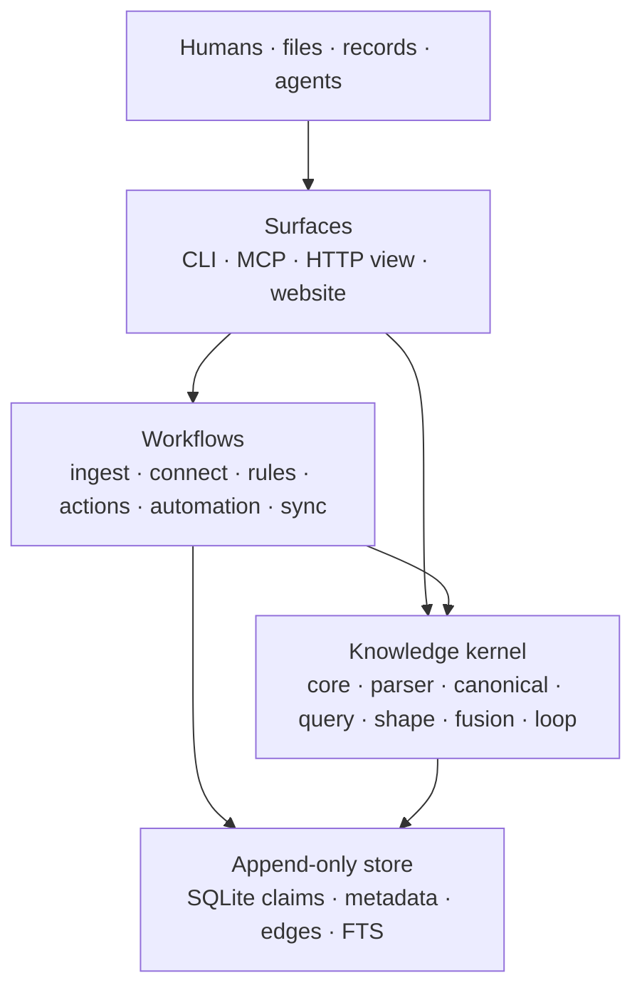
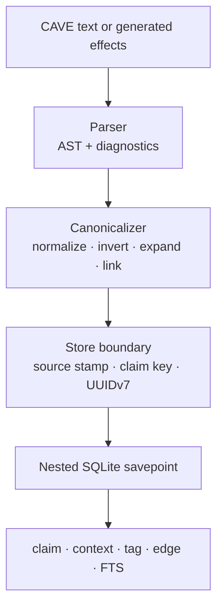
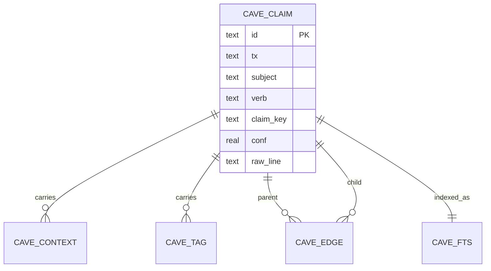
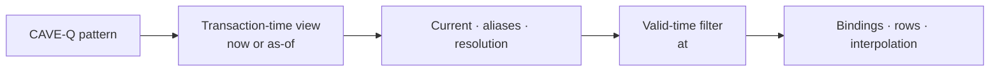
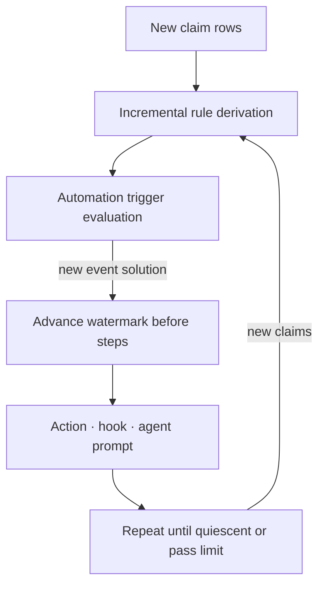

# CAVE Architecture

CAVE is a local-first knowledge engine built around one durable abstraction:
an immutable, atomic claim. The language, query engine, rules, actions,
automation, synchronization, agent integration, and user interfaces all
operate on the same append-only claim store.

This document explains the system structure and runtime flows. For user-facing
syntax and examples, see [README.md](README.md). For package-by-package
implementation details and specification decisions, see
[IMPLEMENTATION.md](IMPLEMENTATION.md).

## System at a glance

The arrows show dependency direction, not a mandatory request path. A simple
`cave query` enters through the CLI and calls the query and store packages
directly; `cave ingest` adds an agent-mediated workflow before reaching the
same store.

Three boundaries shape the design:

1. **Text becomes data once.** CAVE text is parsed and canonicalized before it
   is keyed or persisted. Reads operate on stored columns and side tables,
   rather than reparsing `raw_line`.
2. **Belief changes append.** An update or retraction is a new row in the same
   belief series. Existing rows remain addressable for history, provenance,
   bitemporal queries, and synchronization.
3. **Policy is mostly knowledge.** Verb declarations, rules, actions,
   automations, shape expectations, source reliability, and source precedence
   are stored as claims. The executable machinery remains in code, while the
   configuration it interprets travels with the knowledge.

## Core model

The domain model lives in `@cavelang/core`. A canonical claim contains:

- a subject term and uppercase primary verb;
- one of four payloads: relation, attribute/value, metric, or no payload;
- negation, confidence, importance, uncertainty, contexts, tags, and comment;
- the original authored line for display and interchange.

The store adds two UUIDv7 fields. Today the same UUID is used for both:

| Field | Meaning |
|---|---|
| `id` | Global identity of this immutable row. Sync deduplicates by it. |
| `tx` | Transaction order. UUIDv7 lexical order is chronological and monotonic within the store. |
| `claim_key` | Identity of the belief series, computed from canonical content and identity-bearing contexts. |
| `raw_line` | Authored representation, retained even when an inverse form canonicalizes to another direction. |

A **belief series** is every row sharing a `claim_key`. The current belief is
the row with the greatest `tx`; a row at `0%` confidence is a retraction, not a
deletion. Multiple sources intentionally form separate series and may coexist
as a contested fact. Resolution is an optional read mode that ranks those
current rows without rewriting them.

### Canonical direction and the verb registry

Relations have one physical direction. In-band declarations such as
`CONTAINS REVERSE PART-OF` update a verb registry. Canonicalization maps either
written direction onto the primary direction before computing the claim key.
Queries and traversals use the same registry to expose inverse readings.

The registry starts from the standard prelude unless a caller opts out. It is
then rebuilt from stored declarations on open, and can also be reconstructed at
an `--as-of` boundary so vocabulary and data agree historically.

## Write path

All text-producing entry points converge on the same pipeline. Structured
connectors first instantiate deterministic CAVE templates; agents either call
MCP tools or return CAVE text; the CLI, imports, rules, actions, and automation
eventually append canonical claims.

`@cavelang/parser` has a diagnostic form that never throws and a strict form
for callers that require all-or-nothing validation. `@cavelang/canonical`
turns structural lines into canonical claims and converts indentation into
explicit `WHEN`, `VIA`, `BECAUSE`, or `QUALIFIES` edges.

`@cavelang/store` owns persistence and transaction identity. It can stamp an
actor context such as `@src:cli`, `@src:agent/<client>`, or
`@src:action/<name>` before keying. Replay paths deliberately avoid stamping
so exported identities remain stable.

Nested savepoints make compound writes atomic. Shape-gated ingest, action
effects, connector record updates, sync, and dry runs all use the same
transaction mechanism. Rolling back also restores the in-memory verb registry.

### Physical schema

SQLite is normalized around `cave_claim`:

Typed value columns support numeric filters without losing the authored value.
Contexts and tags stay in side tables because each claim may carry several.
Edges refer to immutable row IDs so derivation and qualifier lineage names the
exact evidence, not merely its current replacement. FTS indexes the searchable
claim text.

## Read path

`@cavelang/query` parses a CAVE-Q pattern and compiles it to parameterized SQL.
Normal patterns become filtered selects; transitive `VERB+` patterns become
recursive CTEs with a depth cap. Inverse verbs swap query endpoints against the
same canonical rows.

The default row universe is current belief: latest row per `claim_key`, with
positive queries excluding retracted rows. Callers can change that universe
with orthogonal options:

| Option | Effect |
|---|---|
| `all` | Read full append history instead of only current rows. |
| `asOf` | Hide later transactions and reconstruct current belief at that transaction-time boundary. |
| `at` | Filter by valid-time contexts and interpolate trajectory values. |
| `aliases` | Widen entity matching through the current positive `ALIAS` closure. |
| `resolve` | Rank contested current beliefs and expose only winners. |
| `support` | Return the concrete edge rows supporting a transitive match. |

Alias handling is union-of-rows: it widens matching but never renames stored
entities, changes claim keys, or silently merges belief series. Resolution is
also non-destructive: losing candidates remain available in ordinary and
historical reads.

Transaction time and valid time are independent:

This separation makes questions such as “what did the store believe last year
about 1962?” a composition of `asOf` and `at`, not a special query type.

## Derived and governed behavior

Rules, actions, and automations share the query and append primitives but have
different authority:

| Mechanism | Who initiates it? | Condition | Result |
|---|---|---|---|
| Rule | Derivation engine | Premise join over current belief | Derived claims with noisy-AND confidence and lineage. |
| Action | Explicit caller or MCP tool | Parameters plus preconditions | Atomically appended, shape-gated effects; optional post-commit hook. |
| Automation | New rows after a watermark | Trigger solution contains a new event row | Actions, hooks, or agent prompts, repeated until quiescent. |

Rules are stored under `rule/<digest>`, actions under `action/<name>`, and
automations under `automation/<name>`. Derived or governed writes link to exact
premise rows with `BECAUSE` edges and to their declaration with a `VIA` edge.

The watermark advances before automation steps execute. This gives hooks and
other outside-world effects at-most-once behavior across retries: a crash may
drop a notification, but it does not replay one. Hooks are never stored as
commands; claims name a hook while an out-of-band configuration supplies its
shell template. Action hooks run only after the database transaction commits.

## Ingestion and integration boundaries

- **`@cavelang/connect`** handles structured sources deterministically. It
  maps CSV, TSV, JSON, JSONL, SQLite, or URL records through templates, tracks
  per-record digests, and retracts stale output from changed or removed
  records. Federated queries temporarily append mapped rows inside a
  transaction and then roll it back.
- **`@cavelang/ingest`** orchestrates unstructured extraction. Files and web
  pages are batched, optional store context is included in the prompt, and a
  headless agent writes through MCP or returns CAVE text. Source digests are
  recorded only after a successful batch.
- **`@cavelang/mcp`** is a tools-only stdio JSON-RPC server. Static tools expose
  core reads and writes; current action declarations generate `act_<name>`
  tools dynamically. Tool allowlists and read-only mode form the permission
  boundary.
- **`@cavelang/sync`** unions stores by immutable row ID. Database sync copies
  rows and side tables verbatim; annotated text sync replays the same IDs
  through the canonical pipeline. Contradictions coexist and are resolved on
  read, so merge itself is idempotent and conflict-free.
- **`@cavelang/eval`** runs extraction and reconstruction fixtures in fresh
  stores. It tests both claim-key accuracy and query behavior, keeping quality
  measurement outside the production store.
- **`@cavelang/scenario`** freezes CAVE-Q snapshot options and binds typed
  evaluator inputs. Hypothetical claims live only inside a rolled-back
  savepoint, while the resulting exact values and evidence identifiers are
  plain replayable data passed to decision evaluators or solver adapters.

## Package layers

| Layer | Packages | Responsibility |
|---|---|---|
| Domain | `core`, `fusion` | Immutable claim/value types, keys, time, UUIDv7, probabilistic math. |
| Language | `parser`, `canonical` | CAVE text, diagnostics, inverse registry, canonical claims, emission. |
| Data | `store`, `query`, `shape` | SQLite persistence, CAVE-Q, resolution, expectations, health and write gates. |
| Formal reasoning | `solver`, `scenario` | Portable exact models and backend-neutral results; typed snapshot and ephemeral-overlay bindings. |
| Behavior | `rules`, `act`, `automate`, `loop` | Derivation, governed writes, event processing, active reconstruction policies. |
| Movement | `connect`, `ingest`, `sync` | Deterministic records, agent extraction, and store union. |
| Integration | `mcp`, `eval` | Agent tool protocol and repeatable quality evaluation. |
| Presentation | `cli`, `view` | Command dispatch, read-only local HTTP views, and cited reports. |
| Language tooling | `tree-sitter-cave`, `highlight`, `editors/vscode` | Shared grammar, highlight query, terminal and editor rendering. |
| Browser | `website` | Documentation and an ephemeral playground using the kernel with SQLite WASM. |

Dependencies point inward toward the domain, language, and data packages.
Higher-level packages compose lower-level functions; the lower layers do not
call the CLI, MCP, HTTP, or agent surfaces. Some workflows intentionally reuse
one another—for example, actions use connector template substitution and
ingestion can expose MCP to an agent. The codebase favors small functions and
immutable values, with no class-based domain model.

## Runtime variants

The primary runtime is Node.js 22.18 or newer. TypeScript source is executed
directly with type stripping, `node:sqlite` supplies persistence, and
`node:test` supplies the test runner. `tsc -b` is a strict typecheck rather
than a required production build.

The website playground reuses `core`, `parser`, `canonical`, `store`, and
`query`. Vite aliases `node:sqlite` to a small compatibility adapter backed by
`sql.js`; the database is in memory and isolated to the browser tab. Node-only
capabilities such as filesystem ingestion, shell hooks, sync from files, and
the local HTTP server remain outside the browser bundle.

The Tree-sitter grammar is a parallel syntax artifact for highlighting. It is
the shared source for terminal, website, and VS Code highlighting, but the
semantic parser remains `@cavelang/parser`.

## Architectural invariants

Changes should preserve these properties:

1. **Canonicalize before identity.** Inverse spellings and continuations must
   converge before claim-key computation.
2. **Never update or delete belief rows in normal operation.** Append a new
   belief or a `0%` retraction; keep history observable.
3. **Treat row IDs as global identities.** Sync must preserve IDs, transaction
   order, side tables, raw text, keys, and lineage edges.
4. **Keep reads non-destructive.** Aliasing, contradiction resolution,
   valid-time evaluation, and reconstruction must not rewrite stored claims.
5. **Use the store transaction boundary for compound writes.** Validation and
   its writes must commit or roll back together, including registry changes.
6. **Keep external effects after commit and out of the store.** Persist names,
   prompts, provenance, and watermarks; configure executable commands outside
   the knowledge base.
7. **Reuse the kernel from every surface.** CLI, MCP, HTTP, connectors, and the
   browser should not grow competing parsers, key rules, query semantics, or
   persistence models.

## Where to make a change

| Change | Start in |
|---|---|
| Claim or value semantics | `packages/core` |
| CAVE syntax or diagnostics | `packages/parser`, then `packages/canonical` |
| Canonical text output or inverse behavior | `packages/canonical` |
| Schema, belief history, traversal, resolution | `packages/store` |
| CAVE-Q patterns or SQL compilation | `packages/query` |
| Scenario, decision, or solver input binding | `packages/scenario` |
| Expectations, gates, health, alias suggestions | `packages/shape` |
| Derived, governed, or event-driven writes | `packages/rules`, `packages/act`, `packages/automate` |
| New data-source workflow | `packages/connect` or `packages/ingest` |
| Agent tool surface | `packages/mcp` |
| User command | feature package first, then `packages/cli` dispatch |
| Read-only UI or report | `packages/view` |
| Public site or browser playground | `website` |
| Highlighting | `packages/tree-sitter-cave`, then its consumers |

The limiting factor for cross-cutting changes is usually identity stability:
a change to normalization, source stamping, contexts, inverse mapping, or key
construction can split or merge belief series and therefore affects history,
resolution, sync, and eval scoring at once.
