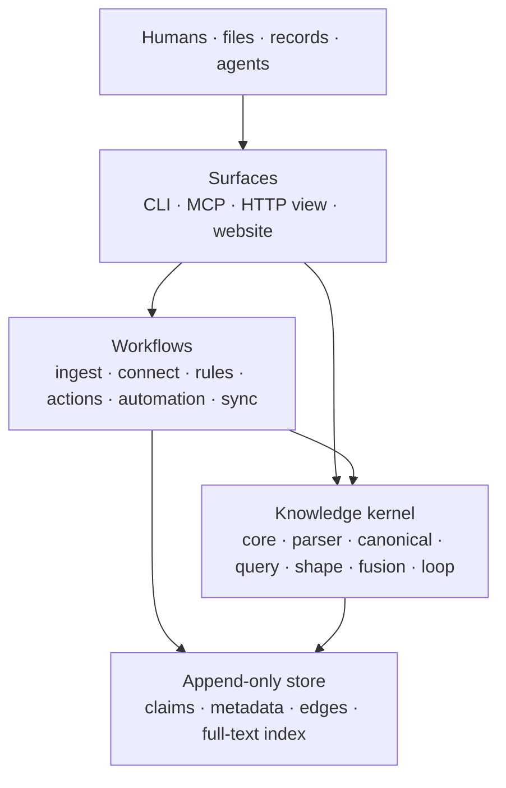
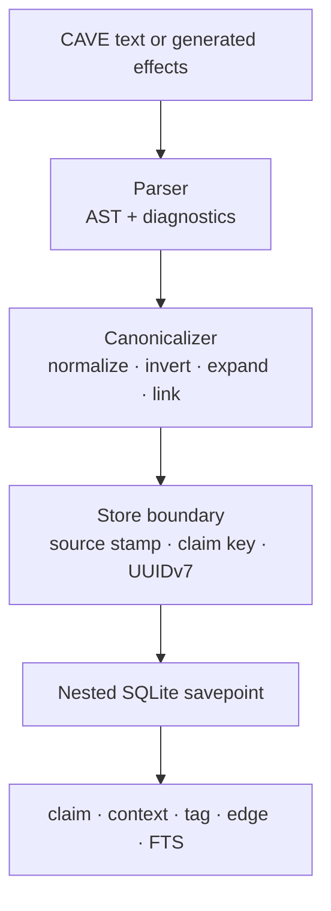
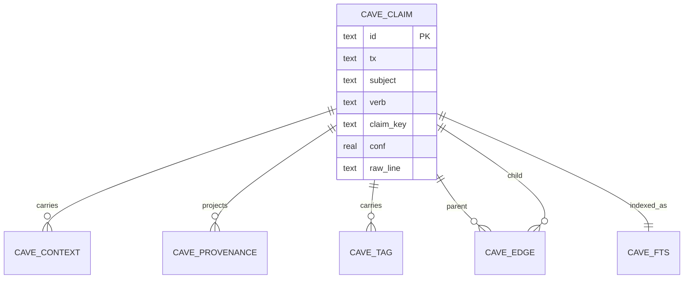
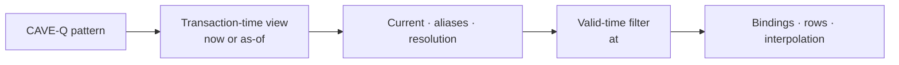
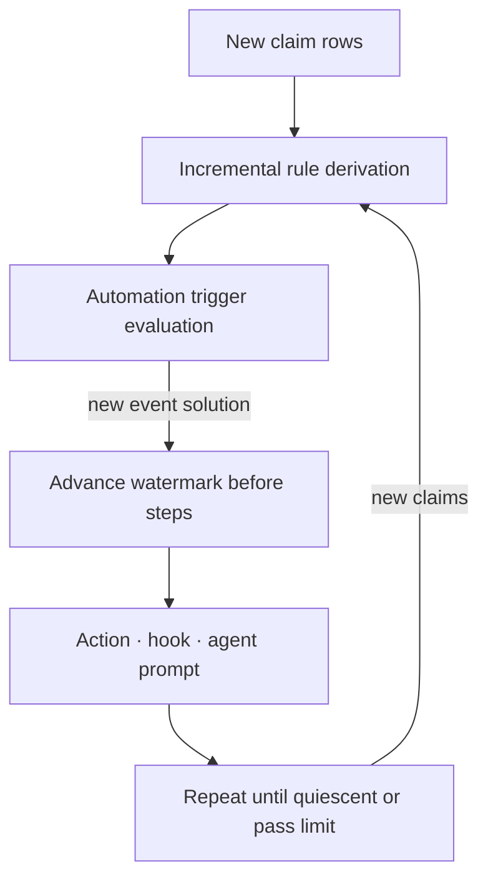

# CAVE Architecture

CAVE is a local-first knowledge engine built around one durable abstraction:
an immutable, atomic claim. The language, query engine, rules, actions,
automation, synchronization, agent integration, and user interfaces all
operate on the same append-only claim store.

This document explains the system structure and runtime flows. For user-facing
syntax and examples, see [README.md](README.md). For package-by-package
implementation details and specification decisions, see
[IMPLEMENTATION.md](IMPLEMENTATION.md).

## System at a glance

```mermaid
flowchart TB
    inputs["Humans · files · records · agents"]
    surfaces["Surfaces<br/>CLI · MCP · HTTP view · website"]
    workflows["Workflows<br/>ingest · connect · rules · actions · automation · sync"]
    kernel["Knowledge kernel<br/>core · parser · canonical · query · shape · fusion · loop"]
    store["Append-only store<br/>claims · metadata · edges · full-text index"]

    inputs --> surfaces
    surfaces --> workflows
    surfaces --> kernel
    workflows --> kernel
    workflows --> store
    kernel --> store
```

The arrows show dependency direction, not a mandatory request path. A simple
`cave query` enters through the CLI and calls the query and store packages
directly; `cave ingest` adds an agent-mediated workflow before reaching the
same store.

Publication is tied to the committed version identity. The publisher binds
validation to its own checkout, overriding any inherited `CAVE_RELEASE_ROOT`
for all child commands. Preflight rejects
tracked edits and non-ignored untracked files; ignored build products remain
allowed at preflight, then release preparation cleans emitted output and build
metadata before regeneration. Incremental caches cannot authenticate ignored
output bytes or remove obsolete files. Validation repeats after preparation
and before npm publication, and
before final tagging, so dirty source inputs cannot silently share a release
identity with their committed counterparts. Registry probes distinguish a
matching identity, an unambiguous npm `E404` code record, and an error.
Code recognition excludes URL/prose matches and conflicting codes. Missing
versions may publish only for the freshly fetched `origin/main` version; an
older fully published release can recover its tag without publishing packages. Unexpected
output or transport failure cannot authorize publication, and retry settings
are validated before requests.

Registry name/version probes establish presence, not equality with local
build bytes. `pnpm release:audit` separately installs the declared public
versions in a temporary directory with lifecycle scripts disabled and verifies
registry signatures and available attestations through npm. It does not require
optional `gitHead` metadata or provenance on every package, preserving local
first-publication bootstrap. See `IMPLEMENTATION.md` for the audit's scope.

Workspace boundaries and release boundaries are intentionally different.
Core libraries with independent consumers remain public npm packages. Rules,
actions, automation, ingestion, MCP, views, and related command
implementations remain focused private workspace packages, bundled and
versioned through documented `@cavelang/cli/<feature>` subpaths. The grammar
and highlighting packages remain independent public tooling for editors. The
machine-enforced classification and migration map live in
[`package-surfaces.json`](package-surfaces.json); rationale and consumer
guidance live in [PACKAGE_SURFACES.md](PACKAGE_SURFACES.md).

The executable has one lifecycle boundary. `dispatch()` normalizes delegated
help, awaits every sync or async handler, routes output, and formats uncaught
errors without stacks unless `CAVE_DEBUG=1`. `runCli()` adds SIGINT/SIGTERM as
one abort signal and awaits command cleanup before returning the conventional
signal exit code. MCP readline, HTTP servers, file watchers, polling timers,
and their stores therefore close through the same path instead of relying on
process termination.

Local command integrations cross one process boundary in `@cavelang/loop`.
Direct commands are executable/argument arrays with no shell interpolation;
agent and hook strings are explicitly platform-shell templates (`/bin/sh` on
POSIX, PowerShell 7 via encoded command transport on Windows). The
boundary separately bounds stdout and stderr, normalizes exits, redacts command
material from failures, and owns
whole-tree termination for timeouts, cancellation, and output overflow. A
worker-backed synchronous facade preserves action and doctor APIs without
weakening those lifecycle guarantees.

The agent layer also owns the iterative JSON syntax index shared by evaluation
and alias judges. It validates candidate spans in linear work before native
decoding. Shared array extraction excludes nested answers inside complete
strings and objects, with an explicit `pairs` wrapper for evaluation. Each
consumer retains its own entry validation and scoring rules.

Three boundaries shape the design:

1. **Text becomes data once.** CAVE text is parsed and canonicalized before it
   is keyed or persisted. Reads operate on stored columns and side tables,
   rather than reparsing `raw_line`.
2. **Belief changes append.** An update or retraction is a new row in the same
   belief series. Existing rows remain addressable for history, provenance,
   bitemporal queries, and synchronization.
3. **Policy is mostly knowledge.** Verb declarations, rules, actions,
   automations, shape expectations, source reliability, and source precedence
   are stored as claims. The executable machinery remains in code, while the
   configuration it interprets travels with the knowledge.

## Core model

The domain model lives in `@cavelang/core`. A canonical claim contains:

- a subject term and uppercase primary verb;
- one of four payloads: relation, attribute/value, metric, or no payload;
- negation, confidence, importance, uncertainty, contexts, tags, and comment;
- the original authored line for display and interchange.

Canonical text preserves the full stored confidence using decimal percentages.
`Confidence.formatExact` provides lossless interchange; `Confidence.format`
provides percentages rounded to two decimal places for presentation.

The store adds two UUIDv7 fields. Today the same UUID is used for both:

| Field | Meaning |
|---|---|
| `id` | Global identity of this immutable row. Sync deduplicates by it. |
| `tx` | Transaction order. UUIDv7 lexical order is chronological and monotonic within the store. |
| `claim_key` | Identity of the belief series, computed from canonical content and identity-bearing contexts. |
| `raw_line` | Authored representation, retained even when an inverse form canonicalizes to another direction. |

A **belief series** is every row sharing a `claim_key`. The current belief is
the row with the greatest `tx`; a row at `0%` confidence is a retraction, not a
deletion. Multiple sources intentionally form separate series and may coexist
as a contested fact. Resolution is an optional read mode that ranks those
current rows without rewriting them.

Claim history is permanent (§9.6). CAVE deliberately has no selective redact
or forget operation: a local rewrite could not guarantee erasure from FTS,
storage remnants, exports, synced peers, backups, snapshots, or storage media,
and would break row-identity convergence. Secrets and selectively erasable
personal data must stay outside the store; accidental ingestion is handled by
quarantining all copies and rebuilding a replacement store from reviewed safe
input.

Publication is sensitivity-scoped (§9.7). An ordinary
`#sensitivity:public|internal|confidential|restricted` tag labels each row;
unlabeled means `internal`, malformed labels fail closed as `restricted`, and
publication defaults to an `internal` ceiling. Export, reports, and the human
HTTP view share this policy, including indirect outputs such as counts,
aliases, history, search, lineage, and edge traversal. The label is routing
metadata—not encryption, authorization, erasure, or a retention boundary.

The human HTTP view marks responses, including errors, `no-store`; HEAD
preserves GET status and cache protection without a body. Its browser navigation
uses a generation counter so superseded requests cannot overwrite the current
view, and malformed fragments remain recoverable through normal navigation.

Report fragments and automation prompts substitute only original template
tokens. Inserted binding text is never reinterpreted as another variable or a
replacement directive. Reports resolve authored citation placeholders before
inserting bindings and reserve existing template footnote labels before assigning
generated citations, preserving both stored values and handwritten references.

The fusion boundary validates finite means, positive finite uncertainty, and
confidence in `[0, 1]` before weighting. It scales means and square-root
precisions to avoid intermediate overflow, and rejects posteriors whose
precision or spread cannot be represented as positive finite numbers.
Duration conversion uses only the declared unit table; arbitrary unit names
remain compatible only with themselves.

Source provenance can carry a stable line anchor (§9.8):
`@src:<percent-escaped-locator>#Lx-Ly`. `@cavelang/core` owns the only
formatter/parser, preserving both the exact stored context and the decoded
underlying source identity. Ingestion numbers embedded text, structured
connectors attach physical record ranges where the format provides them, and
view/report surfaces expose one shared reference shape.

Contexts remain the compact, identity-bearing text representation, while
`cave_provenance` projects four indexed dimensions per row: actor, physical
source, lifecycle run, and domain (§9.5.1). Append callers supply actor/run;
source spans and `scope:` contexts provide source/domain. Lifecycle retraction
and automation echo suppression query the run dimension, so authored source
contexts cannot impersonate or displace engine ownership. Existing claim keys,
context queries, and canonical exports stay compatible; opening old stores
backfills only safely inferable dimensions.

Shape binding follows the complete reachable `EXTENDS` taxonomy. A visited
set terminates cycles without a semantic depth cutoff; deep inheritance
therefore receives the same checks and write-gate enforcement as direct types.
The append gate reads its violation baseline after reserving the write
transaction, so a concurrent repair cannot be mistaken for an old violation
that the current append may reintroduce.

Suggestion appends reserve their transaction before checking pair history in
both directions. A human decision committed while an external judge is running
therefore prevents that retained proposal from being appended. Duplicate input
pairs are written once; scoring and judge decisions remain based on their
original evidence.

Health and discovery readers validate their numeric options before database
reads: finite non-negative stale horizons, finite report timestamps, finite
0..1 score thresholds, and positive safe-integer suggestion limits.

Health reports and alias discovery share an iterative, path-compressing
alias-root lookup. Long alias chains retain their full closure without
recursive calls proportional to chain length. Infrastructure names remain
part of the closure even when excluded from discovery candidates. Health
reports group one ordered read of current non-alias rows in memory, preserving
row order without generating a SQL parameter list per alias group.

Typed clients are derived, not authoritative (§20.4). Current `EXPECTS`
claims normalize to a versioned, SHA-256-stamped TypeScript module whose
readers reuse store traversal and current-belief SQL. Generation is strict on
ambiguous static semantics and deterministic across declaration order and
locale; CAVE text and CAVE-Q remain the source interfaces.

Canonical text export holds one deferred read snapshot across claim selection,
row decoding, metadata, lineage and provenance. It works on read-only connections
and nests inside caller transactions. Concurrent commits appear together on the
next export, preserving a consistent interchange view.

Resolved beliefs, contests and resolved traversals use the same deferred-read
mechanism for policy lookup and claim selection. This prevents a concurrent
commit from applying old precedence/reliability policy to newer claims. Reverse
reads also hold a snapshot across vocabulary refresh and fact selection, even
without resolution. Other unresolved traversals retain their existing query path.
Read snapshots release
after failures and preserve both read and release errors when both fail.

### Canonical direction and the verb registry

Relations have one physical direction. In-band declarations such as
`CONTAINS REVERSE PART-OF` update a verb registry. Canonicalization maps either
written direction onto the primary direction before computing the claim key.
Queries and traversals use the same registry to expose inverse readings.

The same registry handles directional lifecycle declarations such as
`WORKS-AT RENAMED-TO EMPLOYED-BY`. The oldest spelling remains the stable
storage identity, while the replacement becomes the preferred authoring name
and the old name remains compatible. New writes therefore continue the same
claim-key history without mutating historical rows; lifecycle aliases and
inverse direction compose before SQL matching.

The registry starts from the standard prelude unless a caller opts out. It is
then rebuilt from stored declarations on open, and can also be reconstructed at
an `--as-of` boundary so vocabulary and data agree historically.

## Write path

All text-producing entry points converge on the same pipeline. Structured
connectors first instantiate deterministic CAVE templates; agents either call
MCP tools or return CAVE text; the CLI, imports, rules, actions, and automation
eventually append canonical claims.

```mermaid
flowchart TB
    source["CAVE text or generated effects"]
    parse["Parser<br/>AST + diagnostics"]
    canonical["Canonicalizer<br/>normalize · invert · expand · link"]
    identity["Store boundary<br/>source stamp · claim key · UUIDv7"]
    transaction["Nested SQLite savepoint"]
    tables["claim · context · tag · edge · FTS"]

    source --> parse --> canonical --> identity --> transaction --> tables
```

`@cavelang/parser` has a diagnostic form that never throws and a strict form
for callers that require all-or-nothing validation. `@cavelang/canonical`
turns structural lines into canonical claims and converts indentation into
explicit `WHEN`, `VIA`, `BECAUSE`, or `QUALIFIES` edges.

`@cavelang/store` owns persistence and transaction identity. It can stamp an
actor context such as `@src:cli`, `@src:agent/<client>`, or
`@src:action/<name>` before keying. Replay paths deliberately avoid stamping
so exported identities remain stable. Low-level explicit replay validates all
used IDs as canonical lowercase UUIDv7 before inserting rows or advancing the
receive clock; a rejected batch changes neither.

An outer write takes SQLite's immediate reservation lock before allocating
transaction IDs; concurrent processes wait, then observe the committed
`MAX(tx)` before minting. Nested savepoints keep compound writes atomic.
Shape-gated ingest, action effects, connector record updates, sync, and dry
runs all use the same transaction mechanism. Rolling back also restores the
in-memory verb registry.
Ordinary ingest also canonicalizes inside that reservation. It checks SQLite's
`data_version` and refreshes the registry after another connection commits;
local writes reuse the existing registry. Rollback restores the registry's
version marker too, so a failed strict ingest cannot hide peer vocabulary on
retry. Pre-canonicalized `insertResult` callers own their vocabulary snapshot;
raw SQL declaration writers explicitly reload the registry. Annotated-text sync
uses version-aware access under its write reservation; database sync explicitly
rebuilds after copying declarations and lineage through SQL.
Rule derivation, automation trigger reservations and rule/action/automation
declaration entry points use version-aware registry access under their existing
write reservation. Unchanged vocabulary does not require a forced replay at each
entry. Generated vocabulary claims extend the current registry through the
canonicalizer at insertion time, rather than reusing the earlier conclusion
snapshot or replaying all history. Conflicting declarations retain first-
declaration-wins behavior. Lineage edges can exclude existing declarations;
the store still rebuilds when those edges change the active vocabulary.

`scripts/governed-registry-bench.mjs` measures idle derivation/settling and
unchanged declaration calls with 100, 1,000 and 3,000 verb declarations. Run it
alone; setup and result/history assertions are outside five timed samples.
Local medians with 3,000 declarations, before → after, were:

| Operation | Node 24.16.0 | Node 26.5.0 |
|---|---:|---:|
| Idle derive | 28.65 → 0.55 ms | 22.95 → 0.54 ms |
| Idle settle | 58.83 → 0.70 ms | 47.20 → 0.73 ms |
| Unchanged rule declaration | 27.65 → 0.046 ms | 23.35 → 0.096 ms |
| Unchanged action declaration | 27.51 → 0.050 ms | 23.39 → 0.046 ms |
| Unchanged automation declaration | 27.78 → 0.047 ms | 23.20 → 0.121 ms |

These fixtures do not measure changed rule effects, large joins, shape gates or
agent/hook execution. Peer commits still invalidate the cache and may require
replaying declaration history.

Registry access and inverse reads also check the data-version counter, so live
query connections see peer vocabulary without ingesting or reopening. This
refresh performs only reads and works on read-only database connections.
Transaction callbacks receive `{ outermost }`, distinguishing the scope that
commits the database from one that only releases a nested savepoint. This is
store-owned state and is available for every adapter.

### Physical schema

SQLite is normalized around `cave_claim`:

```mermaid
erDiagram
    CAVE_CLAIM ||--o{ CAVE_CONTEXT : carries
    CAVE_CLAIM ||--o{ CAVE_PROVENANCE : projects
    CAVE_CLAIM ||--o{ CAVE_TAG : carries
    CAVE_CLAIM ||--o{ CAVE_EDGE : parent
    CAVE_CLAIM ||--o{ CAVE_EDGE : child
    CAVE_CLAIM ||--|| CAVE_FTS : indexed_as

    CAVE_CLAIM {
        text id PK
        text tx
        text subject
        text verb
        text claim_key
        real conf
        text raw_line
    }
```

Typed value columns support numeric filters without losing the authored value.
Contexts and tags stay in side tables because each claim may carry several.
Edges refer to immutable row IDs so derivation and qualifier lineage names the
exact evidence, not merely its current replacement. FTS indexes the searchable
claim text.

`cave doctor` validates current SQLite stores without writing. Besides schema,
SQLite integrity, and foreign-key checks, its `store.search` check compares
the FTS content rows with the claims in one SQL snapshot. Counts and full-row
set comparison detect duplicates as well as missing, orphaned, and stale
entries; this checks the search content projection, not the FTS engine's
internal posting lists. Diagnostics expose no claim contents or paths, even
when loading a CAVE text store or one of its declared sources fails.

`PRAGMA user_version` is the schema compatibility boundary (§13.2.1).
Unversioned stores start at version 0; ordered forward migrations run one
transaction per version, including backfills, validation, and the version
advance. Newer stores fail before writes, current stores validate rather than
silently replaying DDL, and interrupted migrations resume from the last
committed version. Operational rollback restores a closed-file pre-upgrade
backup; there are no down migrations.

Exact backup is a separate SQLite snapshot path (§13.2.2), not canonical text
replay. `VACUUM INTO` writes a consistent live-store snapshot to a temporary
sibling; integrity, foreign keys, schema structure, fsync, and SHA-256 all pass
before atomic publication. Restore verifies both input and temporary copy,
refuses WAL/SHM sidecars, and then atomically publishes the same bytes. This
preserves row and transaction identity, provenance, lineage, and history while
allowing WAL readers and writers to remain online during backup.

## Read path

`@cavelang/query` parses a CAVE-Q pattern and compiles it to parameterized SQL.
Normal patterns become filtered selects; transitive `VERB+` patterns become
recursive CTEs with a depth cap. Lifecycle spellings resolve to stable storage
verbs, and inverse verbs swap query endpoints against the same canonical rows.
Historical vocabulary reconstruction bounds both declaration rows and qualifier
parents at the requested time. Attaching a later parent cannot retroactively
hide a declaration from earlier queries.

Paged reads pin a transaction cutoff and carry a database-local append revision
in their cursor. Counts and rowid tails cover historical claims and every edge
touching them, including a future parent attached to an old declaration. Each
page compares the revision before and after materialization, rejecting changed
history with a restart error. Later rows and wholly future edges do not
invalidate continuation. This uses only reads and constant-size cursor state;
it does not keep SQLite transactions open between requests.

The default row universe is current belief: latest row per `claim_key`, with
positive queries excluding retracted rows. Callers can change that universe
with orthogonal options:

| Option | Effect |
|---|---|
| `all` | Read full append history instead of only current rows. |
| `asOf` | Hide later transactions and reconstruct current belief at that transaction-time boundary. |
| `at` | Filter by valid-time contexts and interpolate trajectory values. |
| `aliases` | Widen entity matching through the current positive `ALIAS` closure. |
| `resolve` | Rank contested current beliefs and expose only winners. |
| `support` | Return the concrete edge rows supporting a transitive match. |

Alias handling is union-of-rows: it widens matching but never renames stored
entities, changes claim keys, or silently merges belief series. Resolution is
also non-destructive: losing candidates remain available in ordinary and
historical reads.

Transaction time and valid time are independent:

```mermaid
flowchart LR
    query["CAVE-Q pattern"] --> tx["Transaction-time view<br/>now or as-of"]
    tx --> policy["Current · aliases · resolution"]
    policy --> valid["Valid-time filter<br/>at"]
    valid --> result["Bindings · rows · interpolation"]
```

This separation makes questions such as “what did the store believe last year
about 1962?” a composition of `asOf` and `at`, not a special query type.

## Derived and governed behavior

Rules, actions, and automations share the query and append primitives but have
different authority:

| Mechanism | Who initiates it? | Condition | Result |
|---|---|---|---|
| Rule | Derivation engine | Premise join over current belief | Derived claims with noisy-AND confidence and lineage. |
| Action | Explicit caller or MCP tool | Parameters plus preconditions | Atomically appended, shape-gated effects; optional post-commit hook. |
| Automation | New rows after a watermark | Trigger solution contains a new event row | Actions, hooks, or agent prompts, repeated until quiescent. |

Rules are stored under `rule/<digest>`, actions under `action/<name>`, and
automations under `automation/<name>`. Derived or governed writes link to exact
premise rows with `BECAUSE` edges and to their declaration with a `VIA` edge.

All three declaration APIs validate the complete prelude inside the write
reservation before trusting its digest cache. An invalid prelude rejects the
call without new rows or declarations, including when an older version cached
that invalid text. Corrected retries work normally, and unchanged successful
preludes append nothing. This avoids hidden errors and duplicated partial
prelude writes while retaining per-body error reporting after a valid prelude.

Derivation reserves a write transaction before selecting rules or reading
watermarks, refreshes the vocabulary registry within it, and holds the
reservation through premise matching and derived writes. Already-open stores
therefore observe another writer's committed vocabulary and rule revocations.
Support reconciliation has a nested savepoint spanning retractions and their
subsequent evaluation passes. If the pass budget expires, that phase rolls back
and report write counts revert to its entry values; earlier additive work stays
available for retry. Watermarks advance only after complete reconciliation.
Explicit rule retraction likewise selects declarations and validates prefix
ambiguity inside its write reservation, so concurrent declarations cannot
escape retraction or make the selected prefix ambiguous before the writes.

```mermaid
flowchart TB
    append["New claim rows"]
    derive["Incremental rule derivation"]
    trigger["Automation trigger evaluation"]
    watermark["Advance watermark before steps"]
    steps["Action · hook · agent prompt"]
    settle["Repeat until quiescent or pass limit"]

    append --> derive --> trigger
    trigger -->|new event solution| watermark --> steps --> settle
    settle -->|new claims| derive
```

An automation batch reserves a write transaction, reloads its declaration and
vocabulary, evaluates triggers against its watermark, and serializes all matched
premise claims before committing the new watermark. Preparation failure leaves
that batch unclaimed for repair and retry; prepared text retains the selection
snapshot across awaited steps. The watermark commits before any step executes. Competing settlers cannot claim the same
batch. Each automation is rechecked after earlier steps finish; revocations
before its reservation prevent firing, while already-claimed steps continue.
Parsed declarations and vocabulary are reused only while `MAX(tx)`, checked
inside the reservation, is unchanged; the engine's own watermark append can
advance that cache version because it changes neither. Other writes invalidate
the cache, avoiding repeated full declaration parsing during quiet cycles.
The write lock is released before actions, hooks, or asynchronous prompts run.
Settling inside a caller-owned transaction is rejected before any derivation or
batch claim, since nested savepoints cannot commit the firing log independently.
Reports distinguish completion from successful steps: `complete` requires a
quiet final pass and completed rule derivation, while `settled(report)` also
requires no declaration or step errors. Exhaustion prints `incomplete` and
makes `--once` exit nonzero; retrying retains already-committed watermarks.
Enabled derivation's malformed rule declarations join automation declaration
errors in the structured `problems` list and make `--once` fail. Valid rules
and automations continue; disabling derivation also skips its rule checks.
Automation cancellation checks the signal before settling, passes, batch
claims, and steps, and after agent completion. Late replies are discarded;
already-committed batch watermarks persist. Custom completion callbacks own
their work's cancellation, while CLI agents use the process runner's cleanup.
The daemon yields between repeated settles so signal callbacks can run and
does not start polling after a cancelled startup cycle.
This gives hooks and
other outside-world effects at-most-once behavior across retries: a crash may
drop a notification, but it does not replay one. Hooks are never stored as
commands; claims name a hook while an out-of-band configuration supplies its
shell template. Standalone action execution reserves its write transaction
before loading the declaration, refreshing vocabulary, matching premises, or
reading baseline shape violations. These reads and effect writes share the
same transaction, so a competing revocation cannot slip between validation
and commit. The baseline shape snapshot is taken immediately before the first
changed effect. Entirely unchanged actions skip both shape snapshots while
retaining declaration, argument and premise checks. Action hooks run after an
outermost action transaction commits.
If a configured hook would fire inside a caller-owned transaction, the action
fails and rolls back only its own savepoint. No-op executions, dry runs, and
actions without configured hooks remain nestable. This preserves the
synchronous hook result contract without allowing effects to escape a later
outer rollback or silently deferring delivery.

## Ingestion and integration boundaries

- **`@cavelang/connect`** handles structured sources deterministically. It
  maps CSV, TSV, JSON, JSONL, SQLite, or URL records through templates, tracks
  per-record digests, and retracts stale output from changed or removed
  records. A pass with failed records whose prior identity is unknown skips
  disappearance pruning, while valid records still update. A changed source
  declaration replaces its data atomically: any failed replacement record
  rolls back retirement, new rows, and declaration bookkeeping together.
  Federated queries temporarily append mapped rows inside a
  transaction and then roll it back. Sources declared in-band as
  `source/<name>` claims run the same pass without arguments, and the
  package's `assemble` is what the CLI, MCP, serve, automate, and ingest
  surfaces hand to `openAt` so a CAVE text file used as a store follows the
  sources it declares.
- **`@cavelang/ingest`** orchestrates unstructured extraction. Strict
  staging uses an exact SQLite snapshot to preserve explicit provenance and
  stored data, and checks the final sync report before returning success.
  A rejected identity merge fails without applying the stage. Files and web
  pages are batched, optional store context is included in the prompt, and a
  headless agent writes through MCP or returns CAVE text. Store context refreshes
  between batches from current, non-retracted beliefs, including prior staged
  updates in strict mode. Related-claim search has a bounded candidate window;
  [context selection and limits](packages/ingest/README.md#api-access-context-slice--full-tools)
  describe what the prompt includes. URL selection uses
  at most eight concurrent fetches, including body reads, and retains source
  order; cancellation prevents queued fetches from starting. This does not cap
  total retained source content. Source digests are recorded only after a
  successful batch; strict mode publishes those staged digests only when the
  whole run succeeds. A source reported as accepted can still belong to a
  discarded stage: [publication and retry semantics](packages/ingest/README.md#exit-codes-retries-and-agent-calls)
  distinguish batch outcome from target-store changes.
- **`@cavelang/mcp`** is a tools-only stdio JSON-RPC server. Static tools expose
  version-matched operating guidance plus core reads and writes; current action
  declarations generate `act_<name>` tools dynamically. Tool allowlists and
  read-only mode form the permission boundary.
- **`@cavelang/sync`** unions stores by immutable row ID. Database sync copies
  rows and side tables verbatim; annotated text sync replays the same IDs
  through the canonical pipeline. Contradictions coexist and are resolved on
  read, so valid replicas merge idempotently without belief conflicts.
  Database sync checks overlapping identities under its write reservation:
  stored claim fields, contexts, tags, and explicit provenance must agree
  before any rows or edges copy. Raw spelling, metadata order, and safely
  inferred provenance differences are compatible; legacy sources without
  provenance tables are checked through their claim data and contexts.
  Conflicts return structured problems and CLI failure, including dry runs.
  Database-file sync owns its transaction and attachment lifecycle; it rejects
  caller-owned transactions before attaching, because SQLite cannot detach a
  source used by an uncommitted outer transaction. Annotated-text sync remains
  nestable and follows the caller's commit or rollback.
  Text sync refreshes vocabulary, validates and canonicalizes input, and replays
  rows under one write reservation; dry runs restore the prior registry and
  UUID state along with rolling back rows.
  Annotated export carries a complete JSON provenance object when compact
  contexts cannot reconstruct the stored dimensions. Replay validates payloads
  before any write and preserves exact sets, including empty dimensions.
  Database copying infers dimensions only when the source lacks their table.
  Text replay compares reused IDs with both input restatements and existing
  target rows before copying anything. Canonical interchange content must
  agree, independent of raw spelling and metadata ordering, so mismatched
  restatements cannot attach misleading lineage to existing rows.
- **`@cavelang/eval`** runs extraction and reconstruction fixtures in fresh
  stores. It tests both claim-key accuracy and query behavior, keeping quality
  measurement outside the production store.
- **`@cavelang/scenario`** shares exact fraction reduction with the solver's
  `Exact.fromBigInts` entry point, avoiding duplicate GCD code and intermediate
  decimal serialization. It freezes CAVE-Q snapshot options and binds typed
  evaluator inputs. Hypothetical claims live only inside a rolled-back
  savepoint, while the resulting exact values and evidence identifiers are
  plain replayable data passed to decision evaluators or solver adapters. Its
  explanation bridge retains authored values, binding queries, snapshot
  policy, and exact evidence identities in a solver-neutral run context. Its
  explicit result-governance API records immutable run artifacts atomically
  and idempotently, while recommendation, decision, action audit, and external
  effect audit records remain distinct versioned types.
- **`@cavelang/solver`** exposes bounded feasibility, optimization,
  counterexample, and sensitivity workflows over one portable model and can
  wrap backend results in a versioned explanation report. Deterministic
  tie-breaking, explicit scope, transitions, and unknown regions stay above
  adapters. Reports map assignments, evaluated constraints, objective
  contributions, and unsatisfiable cores to stable model locations, CAVE rows,
  and scenario inputs. Solve calls copy and freeze the validated model before
  adapter execution; explanation calls also copy context and reject mismatched
  replay digests before solving. Later caller edits cannot change submitted
  identity or evidence. Validation budgets aggregate pre-reduction numeric digits
  across bounds, literal occurrences, and soft weights before exact parsing;
  this input budget does not bound intermediate arithmetic. Local hard/soft
  evaluation separately checks estimated integer sizes (`maxExplanationBits`)
  and cumulative estimated-bit work (`maxExplanationWork`) before guarded
  arithmetic. Exhaustion makes the affected evaluation indeterminate while
  preserving the backend result. Each report shares one allowance and reuses
  completed identical ordered expressions; a new report starts fresh. These
  guards do not bound all report phases, standalone exact helpers, linear
  classification, process memory or elapsed time.
  Workflows snapshot model, options, and context for the whole operation;
  sensitivity also snapshots its request so successive samples keep the same
  submitted bindings and limits. Replay mismatch fails before backend execution.
  Scope theories include requirements from expressions and literals, using the
  same capability analysis as preflight; domains list declared variables only.
- **`@cavelang/solver-z3`** is the optional Node.js search backend. It lazily
  loads the official threaded Z3 Wasm package, compiles only solver-neutral
  models, queues checks through one process runtime, and shuts workers down
  explicitly. Its allowlisted workflow fixture is a separate opt-in binary;
  no kernel, main CLI, MCP, or browser package depends on it.

## Package layers

| Layer | Packages | Responsibility |
|---|---|---|
| Domain | `core`, `fusion` | Immutable claim/value types, keys, time, UUIDv7, probabilistic math. |
| Language | `parser`, `canonical` | CAVE text, diagnostics, inverse/lifecycle registry, canonical claims, emission. |
| Data | `store`, `query`, `shape` | Persistence (SQLite today, behind an explicit adapter), CAVE-Q, resolution, expectations, health and write gates. |
| Formal reasoning | `solver`, `scenario`, optional `solver-z3` | Portable exact models and backend-neutral results; typed snapshot bindings; explicit immutable result recording; opt-in Z3 search. |
| Behavior | `rules`, `act`, `automate`, `loop` | Derivation, governed writes, event processing, active reconstruction policies. |
| Movement | `connect`, `ingest`, `sync` | Deterministic records, agent extraction, and store union. |
| Integration | `mcp`, `eval` | Agent tool protocol and repeatable quality evaluation. |
| Presentation | `cli`, `view` | Command dispatch, read-only local HTTP views, and cited reports. |
| Language tooling | `tree-sitter-cave`, `highlight`, `editors/vscode` | Shared grammar, highlight query, terminal and editor rendering. |
| Browser | `website` | Documentation and an ephemeral playground running the kernel in the browser on an in-memory store. |

Dependencies point inward toward the domain, language, and data packages.
Higher-level packages compose lower-level functions; the lower layers do not
call the CLI, MCP, HTTP, or agent surfaces. Some workflows intentionally reuse
one another—for example, actions use connector template substitution and
ingestion can expose MCP to an agent. The codebase favors small functions and
immutable domain values rather than class-based domain entities; conventional
`Error` subclasses carry typed failure details at API boundaries.

## Runtime variants

The supported Node.js lines are 24 and 26, starting at 24.16.0 and 26.1.0
respectively; Node.js 24.21.0 Active LTS is the recommended production runtime, and
Node.js 26.8.1 Current is also tested; other Node lines are outside the support
contract. Linux, macOS, and Windows are supported, represented in CI
by Ubuntu 24.04, macOS 15, and Windows Server 2022. The full suite runs on the
recommended runtime, while a focused matrix proves the exact minimum, Node 26,
and the platform-sensitive process, filesystem, native grammar, built-package, and
`node:sqlite` paths on every supported OS. During development, TypeScript source
can execute directly through Node's type stripping; `node:sqlite` supplies
persistence and `node:test` supplies the test runner. Release and CI builds run
composite `tsc -b`, which both typechecks and emits package `dist/` trees
consumed by packed npm artifacts.

The website playground reuses `core`, `parser`, `canonical`, `store`, and
`query`. It passes a SQL.js/WASM implementation to the store's explicit SQLite
adapter boundary; the database is in memory and isolated to the browser tab.
Rebuilds prepare a replacement database before closing the active one. Failed
strict ingestion closes only the candidate, preserving the previous claims and
verb registry so the user can query the last good state and correct the editor.
The Node adapter declares FTS5, extension loading, and exact snapshot support;
the browser adapter declares FTS4 and no file backup. Shared contract tests
exercise SQL, transactions, and full-text behavior for both. Node-only
capabilities such as filesystem ingestion, shell hooks, sync from files, and
the local HTTP server remain outside the browser bundle.

The Tree-sitter grammar is a parallel syntax artifact for highlighting. It is
the shared source for terminal, website, and VS Code highlighting, but the
semantic parser remains `@cavelang/parser`.
The VS Code activation owns its parser and query: disposal unregisters the
provider before releasing both resources, and failed setup releases partial
allocations. Each token request releases its document tree even on query errors.
The Node and website highlighter loaders share pending and successful loads,
but discard rejected promises so later calls can recover. The website retains
plain source on failure and retries on later mounts or edits, not on a timer.

Shared SQL semantics live in `@cavelang/store`'s public `QuerySql` namespace.
Store reads, CAVE-Q, shape discovery, generated typed clients, and view models
compose its latest-per-key, alias-closure, and transaction-boundary fragments.
Retraction and negation remain explicit consumer predicates: “current” means
the latest row in every belief series, including a latest `@ 0%` or denial.

Serialized claim boundaries use `cave.claim/v1`, never `cave_claim` rows.
`cave.query-match/v1` composes those records for CLI and federated JSON;
library decoders verify versions and semantic identity against checked-in
fixtures. Raw rows remain available to in-process storage/reasoning code. MCP
and text export use canonical CAVE lines as their explicit interchange
contract.

Scenario evaluation is outside the language core. A frozen
`cave.scenario/inputs@1` record feeds either a solver or an ordinary versioned
deterministic evaluator after every hypothetical overlay has rolled back.
Durable evaluation, recommendation, human decision, action audit, and external
effect audit are separate append-only artifacts with checked predecessors.
Each artifact ID must preserve its exact namespaced entity spelling. Both reads
and writes validate that generated CAVE text is one artifact claim with that
subject and payload; IDs cannot introduce additional claims or redirect a
predecessor lookup through comments or whitespace normalization.
Artifact writers compare the complete claim series inside their transaction:
retraction does not free an ID for different content. Identical content can be
explicitly restored, while reads and predecessor checks continue to treat a
currently retracted record as absent.
Canonical artifact serialization sorts object keys and omits undefined optional
fields, but rejects sparse arrays, cycles, non-finite numbers, and non-JSON
objects before insertion. Shared non-cyclic objects serialize normally; validation
tracks the current ancestor path rather than rejecting all repeated references.
Frozen scenario inputs also carry a digest of their complete authored
definition. Explanation conversion checks that digest and the record's own
content digest before joining definition queries to evidence. Thus an unchanged
scenario ID and model digest cannot conceal changed binding queries or policies.
Legacy records without a definition digest require rebinding for this conversion.
Scenario transaction metadata uses the store's shared CAVE-Q boundary parser,
so year/month/day periods and exact UUID cutoffs select the same historical
head as the binding queries. Missing overlay entries use own-key lookup.
Binding definitions validate enumerated snapshot and input policies before
reading the store. Unknown choices cannot silently select exact matching,
coexisting resolution, permissive input handling, or first-value reduction.
Scenario materialization also guards SQLite data_version and local total_changes
around its reads. Peer commits, including backdated imports, invalidate an
attempt before the evaluator receives it. The overlay's own rolled-back writes
advance the local counter and are accounted for separately. A `snapshot-changed`
error requests rebinding; stable reads without overlays need no write lock.

## Architectural invariants

Shape evaluation and client generation share validation of the reserved
cardinality/unit tags. Runtime readers reject malformed declarations, generators
collect the same diagnostics, and gated writes roll back newly introduced
malformed constraints. Unrelated classification tags retain their normal meaning.

Changes should preserve these properties:

1. **Canonicalize before identity.** Inverse spellings and continuations must
   converge before claim-key computation.
2. **Never update or delete belief rows.** Append a new belief or a `0%`
   retraction; claim history is permanent, and retraction is not sanitization
   (§9.6).
3. **Treat row IDs as global identities.** Sync must preserve IDs, transaction
   order, side tables, raw text, keys, and lineage edges.
4. **Filter publication structurally.** Resolve current belief before applying
   the sensitivity ceiling, and derive all published summaries and graph walks
   only from visible rows. Complete text history and tx-annotated replica
   export must explicitly select `restricted`; exact snapshots are unfiltered
   and sync itself remains exact.
5. **Format source spans once.** Percent-escape source locators and parse line
   fragments through `SourceSpan`; connectors, APIs, and reports must not grow
   competing source-link conventions.
6. **Keep generated clients derived and reproducible.** Version the normalized
   schema, sort by code point, fail ambiguous mappings, and never make generated
   TypeScript the schema source of truth.
7. **Keep provenance dimensions separate.** Preserve compact contexts for
   identity and interchange, but use explicit actor/source/run/domain rows for
   policy and lifecycle ownership.
8. **Version every physical schema change.** Add one ordered transactional
   migration, advance `user_version` in that transaction, and reject unknown
   future versions.
9. **Publish snapshots only after verification.** Build beside the target,
   fsync and validate it, record SHA-256, and never restore over active SQLite
   sidecars.
10. **Keep reads non-destructive.** Aliasing, contradiction resolution,
   valid-time evaluation, and reconstruction must not rewrite stored claims.
11. **Use the store transaction boundary for compound writes.** Validation and
   its writes must commit or roll back together, including registry changes.
12. **Keep external effects after commit and out of the store.** Persist names,
   prompts, provenance, and watermarks; configure executable commands outside
   the knowledge base.
13. **Reuse the kernel from every surface.** CLI, MCP, HTTP, connectors, and the
   browser should not grow competing parsers, key rules, query semantics, or
   persistence models.

## Where to make a change

| Change | Start in |
|---|---|
| Claim or value semantics | `packages/core` |
| CAVE syntax or diagnostics | `packages/parser`, then `packages/canonical` |
| Canonical text output or inverse behavior | `packages/canonical` |
| Schema, belief history, traversal, resolution | `packages/store` |
| CAVE-Q patterns or SQL compilation | `packages/query` |
| Scenario, decision, or solver input binding | `packages/scenario` |
| Z3 compilation or runtime lifecycle | `packages/solver-z3` |
| Expectations (presence, exact-one cardinality, exact unit), gates, health, alias suggestions | `packages/shape` |
| Derived, governed, or event-driven writes | `packages/rules`, `packages/act`, `packages/automate` |
| New data-source workflow | `packages/connect` or `packages/ingest` |
| Agent tool surface | `packages/mcp` |
| User command | feature package first, then `packages/cli` dispatch |
| Read-only UI or report | `packages/view` |
| Public site or browser playground | `website` |
| Highlighting | `packages/tree-sitter-cave`, then its consumers |

The limiting factor for cross-cutting changes is usually identity stability:
a change to normalization, source stamping, contexts, inverse mapping, or key
construction can split or merge belief series and therefore affects history,
resolution, sync, and eval scoring at once.
